<p align="center">
  
</p>

# TetherIn

**Install once; external API integrations maintain themselves.**

TetherIn turns an official OpenAPI change into a tested migration PR in an
authorized customer repository. It is not a changelog summarizer, a dependency
bump bot, or an auto-merge service: it carries a semantic contract change across
wrappers, transforms, webhooks, tests, and downstream assumptions, then leaves
the final decision with a human.

Provider value: **publish an API change once; send correct migration PRs to
affected customers.** The longer-term distribution layer is an open,
provider-authored executable migration protocol, executed by Codex and
independently analyzed and validated with Greptile evidence.

> Repository status: implementation-ready planning baseline and wire contracts.
> The dashboard and workers are assigned to the three workstreams below. Nothing
> in this repository claims that a live customer migration has already run.

## The evidence pipeline

```mermaid
flowchart LR
    S[Official old/new OpenAPI revisions] --> O[Pinned oasdiff JSON]
    O --> M[Normalized migration manifest]
    M --> G[Greptile KB context enrichment]
    G --> D[Deterministic rg/AST confirmation]
    D --> C[Codex minimal migration]
    C --> T[Tests and typecheck]
    T --> P[Draft GitHub PR]
    P --> R[Greptile repo-aware PR review]
    R --> V[TetherIn validation gate]
    V -->|issues| C
    V -->|clean, same head SHA| H[Human approval and merge]
```



The dashboard presents four customer-facing stages: provider change detected;
affected consumers/files; Codex migration; tests + Greptile + PR ready.

| Component | Exact responsibility |
| --- | --- |
| [oasdiff](https://github.com/oasdiff/oasdiff) | Authoritative semantic OpenAPI `breaking` and `changelog` JSON; pinned to v1.29.1 and verified by upstream checksums. |
| Codex | Works in an isolated checkout, makes the smallest migration patch, and runs repository instructions/tests. |
| Greptile | Supplies available knowledge-base context, independently reviews the PR with whole-repository context, and provides review evidence to TetherIn's validation abstraction. |
| TetherIn | Normalizes provenance, confirms usages deterministically, orchestrates jobs, evaluates the gate, records audit evidence, and manages draft PRs. |
| GitHub + human | Provide least-privilege repository access, branches/checks/PRs, and final merge approval. |

"Code validator" is a TetherIn interface, not a claimed Greptile product name.
It combines Greptile's documented review status/comments with deterministic
coverage and test results. See the [capability truth table](docs/research/greptile-capabilities.md).

## Supported providers

Hackathon scope is deliberately narrow:

| Provider | Official spec source | License | Demo role |
| --- | --- | --- | --- |
| OpenAI | [`openai/openai-openapi`](https://github.com/openai/openai-openapi) | MIT | Deterministic fallback fixture: `geography` removal between two exact commits. |
| Stripe | [`stripe/openapi`](https://github.com/stripe/openapi) | MIT | Preferred hero: an explicit version/deprecation migration, respecting Stripe's versioning model. |
| Twilio | [`twilio/twilio-oai/spec/yaml`](https://github.com/twilio/twilio-oai/tree/main/spec/yaml) | MIT | Supported adapter and contract tests. |

One indisputable live golden path is required; three shallow demos are not. If
the Stripe historical pair does not meet the acceptance rubric, use the retained
real OpenAI pair documented in `contracts/fixtures/oasdiff/README.md`.

## Workstreams

Person A and Person B branch from the same planning baseline and work in
parallel. Person C merges their handoffs and owns the complete product.

| Person | Mission | Owned output | Start here |
| --- | --- | --- | --- |
| A | Provider ingestion, immutable specs, oasdiff, normalization | `packages/provider-pipeline`, provider fixtures/tests | [`docs/workstreams/person-a`](docs/workstreams/person-a/README.md) |
| B | Greptile KB evidence, PR review collection, validation adapter | `packages/greptile`, Greptile fixtures/tests | [`docs/workstreams/person-b`](docs/workstreams/person-b/README.md) |
| C | State machine, dashboard, DB, GitHub App, Codex runner, E2E demo | `apps/**` and integration packages | [`docs/workstreams/person-c`](docs/workstreams/person-c/README.md) |

Read `docs/workstreams/BASELINES.md` for the exact immutable base commit and
handoff merge order. Then start only the assigned branch:

```bash
git fetch origin --tags
git switch --detach <PLANNING_BASE_SHA>
git switch -c person-a/provider-diff     # Person A only
# git switch -c person-b/greptile-evidence  # Person B only
# git switch -c person-c/integration        # Person C only, after A+B handoffs
corepack enable
corepack prepare pnpm@11.23.0 --activate
```

Do not create all three branches in one checkout. Separate agents should use
separate worktrees or clones.

## Repository map

```text
contracts/                 Versioned cross-workstream JSON Schemas and examples
docs/architecture/         State machine and interface contracts
docs/decisions/            Architectural decisions with consequences
docs/research/             Verified primary-source capability research
docs/security/             Threat model and data-boundary rules
docs/demo/                 Honest golden-path rehearsal
docs/workstreams/          Self-contained Person A/B/C work packages
docs/assets/               Supplied artwork and derived web assets
scripts/verify-planning.sh Planning/schema/asset consistency checks
```

## Configuration

Copy `.env.example` to `.env` and supply secrets only in your local secret store.
The checked-in example contains names, never credentials. Required live
integrations are a least-privilege GitHub App, an OpenAI API key for the Codex
runner, and a Greptile API key for `https://api.greptile.com/mcp`. `fixture` mode
must remain visibly labeled in the UI and audit trail.

The default Codex integration is the server-side
[`@openai/codex-sdk`](https://developers.openai.com/codex/sdk) in an ephemeral,
network-restricted checkout. The official
[`openai/codex-action`](https://developers.openai.com/codex/github-action) is an
optional deployment adapter, not the product state machine.

## Demo fixture with real provenance

The committed OpenAI fixture was produced by oasdiff v1.29.1 from official
immutable source commits:

- old: [`13c6a94fca988f8be3c5de09d73f012709985d10`](https://github.com/openai/openai-openapi/commit/13c6a94fca988f8be3c5de09d73f012709985d10)
- new: [`f85dbe223d40e1a31cba812ab2d755c7e98a92a3`](https://github.com/openai/openai-openapi/commit/f85dbe223d40e1a31cba812ab2d755c7e98a92a3)

It detects removal of request property `geography` from `create-project` and
`modify-project`. This is a real contract-diff fixture, not evidence that a live
Greptile review or customer PR has completed.

## Licensing and artwork

TetherIn is MIT licensed. oasdiff is Apache-2.0; the three official provider
spec repositories are MIT. We link/fetch immutable upstream artifacts instead
of relicensing them. See [`NOTICE.md`](NOTICE.md) and
[`docs/provenance.md`](docs/provenance.md).

The original supplied artwork is preserved as
`docs/assets/teatherin-original.png`. It visibly spells **TeatherIn**, while the
product is **TetherIn**. The README uses only a lossless crop of its chain icon;
no corrected wordmark has been fabricated. A corrected, rights-cleared wordmark
is still required before launch.
