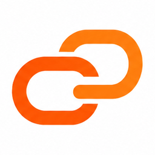
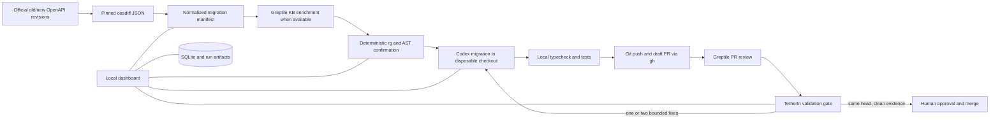

<p align="center">
  
</p>

# TetherIn

TetherIn turns an official OpenAPI change into an evidence-backed migration in
a dedicated consumer repository: oasdiff detects the contract change, Greptile
and deterministic analysis locate affected code, Codex makes the smallest safe
patch, local checks run, and a draft GitHub PR is prepared for a human to merge.

It is not a changelog summary, a package bump bot, or an auto-merge tool. Unlike
Dependabot, it follows behavioral change through direct calls, wrappers,
transforms, webhook handling, tests, and downstream assumptions.

> Repository status: definitive implementation plans, shared contracts, and
> fixtures. Person C is responsible for making the target commands below real.
> Until that handoff lands, `bun run setup` and `bun run demo` are a documented
> operator contract, not a claim that the application already runs.

## Laptop-only hackathon boundary

The hackathon build runs only on the operator's laptop. There is no customer
installer, remote TetherIn service, or TetherIn GitHub application. The local
runner uses an existing authenticated `gh` session and normal Git commands
against one explicitly configured demo repository. GitHub hosts the draft PR;
the human still owns the merge decision.

After Person C completes the integration, the operator path is exactly:

```bash
bun install
cp .env.example .env.local
bun run setup
bun run demo
```

`bun run setup` prints a redacted readiness report. `bun run demo` starts the
dashboard and orchestrator, prints the localhost URL, and shuts both down cleanly.
Use `bun run demo:fixture` for a visibly labeled offline rehearsal or
`bun run demo:live` for the real PR path. Fixture evidence never satisfies the
live-ready gate.

No JavaScript package needs to be installed globally. Required system tools are
Bun 1.4.x, Node 22.18+ for the officially supported Codex SDK sidecar, Git,
GitHub CLI, `rg`, and `jq`. The operator authenticates once with `gh auth login`;
TetherIn reads the token through `gh auth token` when needed and never copies it
into `.env.local`.

## Local evidence pipeline



The local database and redacted run artifacts live under ignored `.tetherin/`.
The configured consumer checkout must be an absolute path outside this Tether
repository, clean at the expected base, and connected to the exact configured
`owner/repo`. Branches use `tetherin/<provider>/<manifest-short-id>`. No force
push is permitted.

| Component | Exact responsibility |
| --- | --- |
| [oasdiff](https://github.com/oasdiff/oasdiff) | The only semantic OpenAPI diff engine; v1.29.1 is pinned and checked against upstream hashes. |
| Person A package | Fetches immutable official specs, invokes oasdiff, preserves raw output, and emits the normalized manifest. |
| Person B package | Enriches impact evidence where Greptile supports it, confirms usages with `rg` and AST analysis, collects PR review evidence, and computes the validation report. |
| Codex | Edits code only inside a disposable consumer checkout using the official local SDK adapter. |
| Person C app | Owns the local state machine, SQLite audit trail, UI, bounded runner, Git and `gh` operations, test execution, and demo. |
| Human | Reviews and merges the draft PR. TetherIn has no merge capability. |

"Code validator" is TetherIn's composite gate, not a Greptile product name. It
combines exact-head test results, deterministic coverage, and Greptile's
documented review status and comments. Greptile's current documented knowledge
base search is substring search over synthesized Markdown, not a guaranteed
semantic blast-radius endpoint. See the
[capability truth table](docs/research/greptile-capabilities.md).

## Supported providers and demo

| Provider | Official source | License | Hackathon role |
| --- | --- | --- | --- |
| OpenAI | [`openai/openai-openapi`](https://github.com/openai/openai-openapi) | MIT | Selected hero: real `geography` removal across two immutable commits. |
| Stripe | [`stripe/openapi`](https://github.com/stripe/openapi) | MIT | Adapter tested; researched deprecation pair yields no semantic oasdiff change and is not hero-eligible. |
| Twilio | [`twilio/twilio-oai/spec/yaml`](https://github.com/twilio/twilio-oai/tree/main/spec/yaml) | MIT | Adapter and contract tests. |

Only one live end-to-end path is required. All three adapters receive unit and
contract tests; the repository must never imply three live migrations. The
[golden-path runbook](docs/demo/golden-path.md) defines the three-minute demo,
retained genuine fallback, and scoped recovery.

## Workstreams

Person A and Person B completed independent branches from the earlier immutable
base and are pinned below. Person C uses the new base in `BASELINES.md`, merges
A then B by exact SHA, preserves both commit histories, and owns only the
integration glue and product.

| Person | Status | Mission | Owned output | Start here |
| --- | --- | --- | --- | --- |
| A | Complete at `da15ba9778ce07c6178a4af4eb42f44fdd7a1fc3` | Provider ingestion, immutable specs, oasdiff, normalization | `packages/provider-pipeline/**`, provider fixtures and tests | [`docs/workstreams/person-a`](docs/workstreams/person-a/README.md) |
| B | Complete at `57a602ba9de7357fd0385f20e23460b8642b74a9` | Greptile evidence, deterministic confirmation, PR review, validation | `packages/greptile/**`, Greptile fixtures and tests | [`docs/workstreams/person-b`](docs/workstreams/person-b/README.md) |
| C | Planned | Local runtime, dashboard, SQLite, Codex, Git and GitHub PR flow, E2E demo | `apps/**`, integration packages, root tooling and final lockfile | [`docs/workstreams/person-c`](docs/workstreams/person-c/README.md) |

Read [`docs/workstreams/BASELINES.md`](docs/workstreams/BASELINES.md) for the
exact planning SHA and A-then-B merge order. Person A and B are complete; the
remaining implementation branch starts in a separate checkout:

```bash
git fetch origin --tags
git switch --detach <PLANNING_BASE_SHA>
git switch -c person-c/integration
# Verify and merge the exact A and B SHAs from BASELINES.md, then:
bun install
```

A and B did not commit `bun.lock`; Person C regenerates and commits the single
root lock after merging their handoffs. The planning baseline includes a tested
root AJV resolution pin required for their combined Bun graph.

## Configuration contract

Copy `.env.example` to ignored `.env.local`. The minimum values are the local
base URL, SQLite and run-artifact paths, mode, an absolute dedicated consumer
checkout, its expected `owner/repo` and base branch, OpenAI key, Greptile mode
and key, and the oasdiff version. Never add a GitHub token. `bun run setup` must
check required secrets without printing them and report each external connection
as ready, unavailable, or fixture-only.

The official [`@openai/codex-sdk`](https://developers.openai.com/codex/sdk/)
currently documents a server-side TypeScript library that controls local Codex
threads and requires Node 18+. Person C therefore keeps Bun as the only operator
entry point while launching a narrow local Node 22 sidecar for this adapter.
Nothing in the Codex prompt may include `.env` files, credentials, unrelated
source, or untrusted evidence as instructions.

## Repository map

```text
contracts/                  Versioned cross-workstream JSON Schemas and examples
docs/architecture/          Local topology and workflow projection
docs/decisions/             Architectural decisions and consequences
docs/design/                Premium dashboard implementation contract
docs/research/              Verified primary-source capability research
docs/security/              Laptop and external-data threat model
docs/demo/                  Three-minute demo and scoped recovery runbook
docs/workstreams/           Self-contained Person A, B, and C packages
docs/assets/                Original artwork and safe chain-icon derivatives
scripts/verify-planning.sh  Planning, schema, asset, and consistency checks
```

## Provenance, licenses, and artwork

TetherIn is MIT licensed. oasdiff is Apache-2.0; the three official provider
spec repositories are MIT. Immutable upstream artifacts are fetched and cached
with their licenses and hashes rather than silently relicensed. See
[`NOTICE.md`](NOTICE.md) and [`docs/provenance.md`](docs/provenance.md).

The supplied original artwork is preserved at
`docs/assets/teatherin-original.png`. It visibly spells **TeatherIn**, while the
product name is **TetherIn**. Product surfaces use only the derived chain icon
plus live text. No corrected wordmark has been fabricated.
