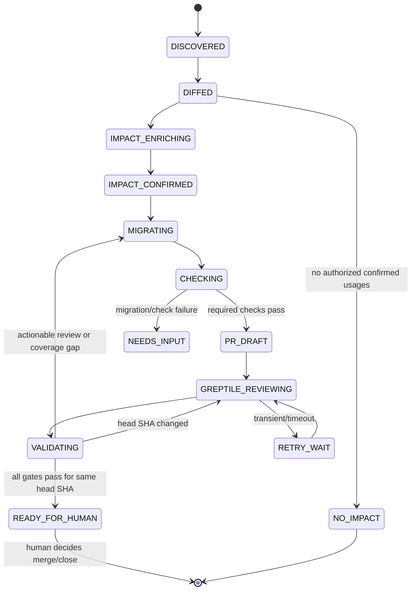

# Architecture and state machine

TetherIn is an evidence-preserving orchestrator around three specialist systems:
oasdiff detects contract semantics, Codex edits code, and Greptile supplies
independent repository-aware evidence. TetherIn owns the workflow, deterministic
confirmation, authorization, persistence, and decision policy.

## Runtime shape

The hackathon implementation is a strict TypeScript pnpm monorepo on Node 22.18+
(Node 24 preferred):

```text
apps/web                     Next.js dashboard and route handlers (Person C)
packages/provider-pipeline   Provider fetch/cache/oasdiff/normalize (Person A)
packages/greptile            MCP KB/review/validation adapters (Person B)
packages/orchestrator        Durable state machine and job handlers (Person C)
packages/github              GitHub App/webhooks/branch/PR/checks (Person C)
packages/codex               Isolated @openai/codex-sdk runner (Person C)
packages/db                  Postgres schema/repositories/audit log (Person C)
fixtures/providers           Official source-derived fixtures (Person A)
fixtures/greptile            Explicitly labeled Greptile fixtures (Person B)
```

Packages exchange only payloads that validate against `contracts/*.schema.json`.
Person C generates TypeScript types and runtime validators during integration;
the checked-in schemas remain the source of truth.

## Stable TypeScript boundaries

The names below are TetherIn interfaces, not upstream API names.

```ts
type Provider = "openai" | "stripe" | "twilio";

interface ProviderAdapter {
  readonly provider: Provider;
  readonly repositoryUrl: `https://github.com/${string}`;
  resolveRevision(ref: string): Promise<SpecRevision>;
  materialize(revision: SpecRevision, cacheDir: string): Promise<LocalSpec>;
  guidance(changes: NormalizedChange[]): Promise<ProviderGuidance[]>;
}

interface ContractDiffEngine {
  compare(input: {
    oldSpec: LocalSpec;
    newSpec: LocalSpec;
    mode: "breaking" | "changelog";
  }): Promise<{ raw: unknown; manifest: MigrationManifest }>;
}

interface GreptileEvidenceAdapter {
  enrichBlastRadius(input: {
    manifest: MigrationManifest;
    consumer: AuthorizedConsumerRevision;
  }): Promise<BlastRadiusReport>;
  triggerReview(input: PullRequestRevision): Promise<ReviewHandle>;
  awaitReview(input: ReviewHandle, signal: AbortSignal): Promise<ReviewEvidence>;
}

interface CodeValidationGate {
  evaluate(input: {
    pullRequest: PullRequestRevision;
    checks: CheckResult[];
    coverage: CoverageResult;
    greptile: ReviewEvidence;
  }): ValidationReport;
}

interface MigrationAgent {
  migrate(input: {
    manifest: MigrationManifest;
    blastRadius: BlastRadiusReport;
    checkout: EphemeralCheckout;
    repositoryInstructions: string[];
  }): Promise<CodexRunEvidence>;
}
```

`CodeValidationGate` is the requested "code validator" abstraction. It is owned
by TetherIn. Greptile's documented contribution is its review state and comments;
tests and deterministic coverage remain separate mandatory inputs.

## State machine



Every transition appends a `tetherin.workflow-event/v1` record. No handler
deletes or rewrites history. `READY_FOR_HUMAN` is allowed only when:

1. the draft PR head SHA equals the SHA tested locally and in GitHub checks;
2. every required check passed and its redacted output digest is recorded;
3. deterministic coverage accounts for every confirmed candidate;
4. the Greptile review is `COMPLETED`, applies to the same head SHA, reports no
   unaddressed blocking comments, and `hasNewCommitsSinceReview` is false;
5. the report is `executionMode: "live"` for a live-ready badge;
6. human approval is still required.

A fixture review can demonstrate UI behavior but can never set a live-ready
badge. A unavailable/not-enrolled KB may allow migration to continue when
deterministic analysis is complete, but it must remain visible as degraded
evidence and cannot be described as a Greptile blast-radius result.

## Idempotency and concurrency

The canonical idempotency key is SHA-256 over a length-prefixed canonical tuple:

```text
provider | old spec commit | new spec commit | GitHub repository node ID | consumer base SHA
```

Store a unique constraint on this key. A retry resumes the same job and its
persisted external IDs. Use a per-consumer advisory lock before branch/PR writes.
The branch is `tetherin/<provider>/<manifest-id-short>`; before pushing, prove
its current head is either absent or belongs to this job. Never force-push a
human-modified branch.

## Provenance flow

The orchestrator stores content-addressed artifacts rather than trusting labels:

```text
spec URL + commit -> downloaded bytes -> SHA-256
  -> oasdiff command/version -> raw JSON SHA-256
  -> normalized manifest -> schema validation + SHA-256
  -> consumer base SHA -> evidence report SHA-256
  -> Codex run/thread + patch SHA-256 -> tested head SHA
  -> PR URL/number -> Greptile review ID + reviewed head SHA
  -> validation report SHA-256 -> human decision
```

Provider and consumer repositories are separate trust domains. Provider text,
Greptile KB text, Greptile comments, and consumer source can all contain prompt
injection; they are data inputs, never executable orchestration instructions.
