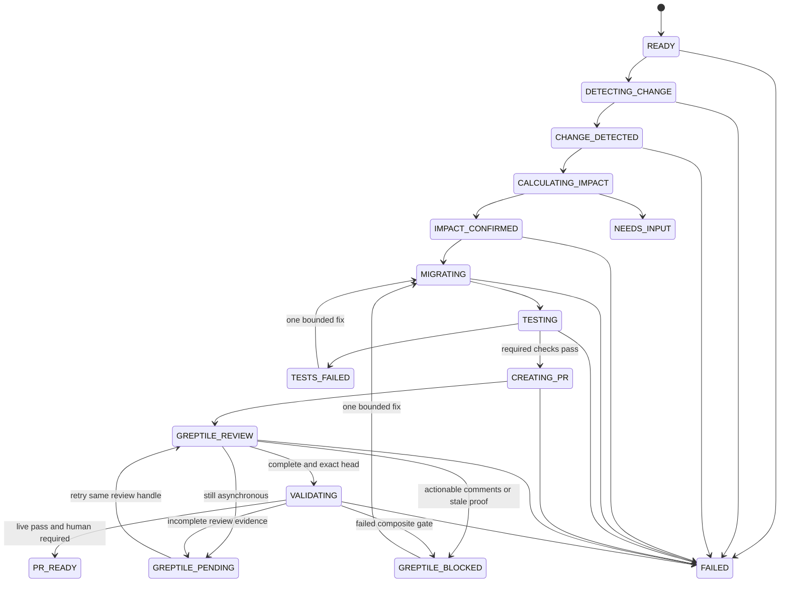

# Local architecture and workflow contract

## Boundary

The hackathon build is one laptop application. Bun is the operator and package
entry point. A Next.js dashboard and bounded local runner share SQLite and an
ignored artifact directory under `.tetherin/`. The runner calls Person A and B
packages in-process, launches the official Codex SDK through a narrow local
Node 22 sidecar, and invokes local Git plus an already authenticated `gh` CLI.

TetherIn itself accepts no inbound internet traffic. The only remote calls are
immutable official provider/spec sources, OpenAI/Codex, Greptile, and the real
GitHub repository and draft PR. The configured consumer checkout is always a
different absolute path from this repository.

```text
apps/web/                       Next.js App Router control-room UI
apps/runner/                    local bounded worker and lifecycle supervisor
packages/orchestrator/          state transitions, idempotency, leases
packages/local-state/           SQLite schema, event append, projections
packages/codex-runner/          Node sidecar client, prompt and diff policy
packages/git-local/             dedicated checkout validation and safe Git ops
packages/github-cli/            typed gh JSON wrapper for PR/head/check reads
packages/provider-pipeline/     Person A handoff, consumed unchanged
packages/greptile/              Person B handoff, consumed unchanged
scripts/setup.ts                readiness checks and SQLite initialization
scripts/demo.ts                 UI/runner supervisor and signal handling
scripts/demo-reset.ts           guarded demo-repository recovery
.tetherin/                      ignored SQLite, locks, artifacts, worktrees
```

The paths above are Person C's required implementation output. They do not exist
in this planning baseline unless explicitly committed later.

## State projection

The append-only source event validates against
`contracts/workflow-event.schema.json`. A materialized `runs.state` projection
uses this exact enum:

```text
READY
DETECTING_CHANGE
CHANGE_DETECTED
CALCULATING_IMPACT
IMPACT_CONFIRMED
MIGRATING
TESTING
CREATING_PR
GREPTILE_REVIEW
VALIDATING
PR_READY
TESTS_FAILED
GREPTILE_PENDING
GREPTILE_BLOCKED
NEEDS_INPUT
FAILED
```



`NEEDS_INPUT` and `FAILED` are terminal for automatic work. `TESTS_FAILED`,
`GREPTILE_PENDING`, and `GREPTILE_BLOCKED` are honest stopped or degraded states
with explicit allowed retry actions. Fixture runs follow the same visual flow,
but validation can only remain pending or fixture-complete; it never projects a
live `PR_READY`.

## Event and projection rules

- Every transition is one transaction: append a canonical JSON payload, digest,
  actor, causation ID, and sequence; then update the materialized run, stage,
  action, and evidence projections.
- Event payloads remain immutable. A correction appends a new event.
- `idempotencyKey` is SHA-256 over provider, old/new spec SHAs, consumer
  `owner/repo`, consumer base SHA, and contract version. Repeated intent returns
  the existing run and never creates a second branch or PR.
- A local worker claims at most one runnable step using an owner UUID and bounded
  `lease_expires_at`. Expired work may resume only after inspecting persisted
  side effects and rechecking current GitHub head.
- The UI reads projections and event pages through local API routes. Refreshing
  or restarting the app must preserve every committed event and render the same
  run state.
- Raw specs, oasdiff JSON, prompt inputs, diffs, redacted command logs, Greptile
  receipts, and reports live in content-addressed run directories. SQLite stores
  their relative path, SHA-256, media type, byte count, label, and exact bound
  consumer/PR head SHA.

## Exact-head evidence

The consumer base SHA is frozen before impact analysis. After Codex creates a
commit, tests bind to that exact head. The `gh` wrapper rereads PR base/head
before review trigger, after review completion, and before validation. Any head
change invalidates checks and review evidence. Any base change stops with
`NEEDS_INPUT` unless the operator explicitly begins a fresh run.

Person B's validator requires live mode, all required checks passed,
deterministic coverage passed, completed Greptile review with no unaddressed
comments, and unchanged head proof. Person C may present a retained genuine run
for an asynchronous demo fallback, but it remains a different run with its own
timestamp and SHAs.

## Local command contract

Person C must implement:

| Command | Required behavior |
| --- | --- |
| `bun run setup` | Validate Bun, Node sidecar, Git, `rg`, `jq`, `gh auth`, redacted configuration, dedicated repo path/remote/cleanliness, Person A oasdiff install and smoke check, SQLite migration, and mode-specific Codex/Greptile connectivity. |
| `bun run demo` | Start web and runner under one supervisor, print the localhost URL and mode, forward signals, and cleanly release local leases and child processes. |
| `bun run demo:fixture` | Force fixture mode, render a permanent fixture treatment, and prohibit live-ready validation or remote write actions. |
| `bun run demo:live` | Require a green live readiness report before any run action. |
| `bun run demo:reset -- --run <id>` | Recover only the configured dedicated demo repo after verifying path, expected remote, TetherIn branch marker, and lack of human commits. Never operate on this repository or an arbitrary path. |

Until Person C commits these scripts, documentation may describe them only as
required outputs, never as successful current commands.
